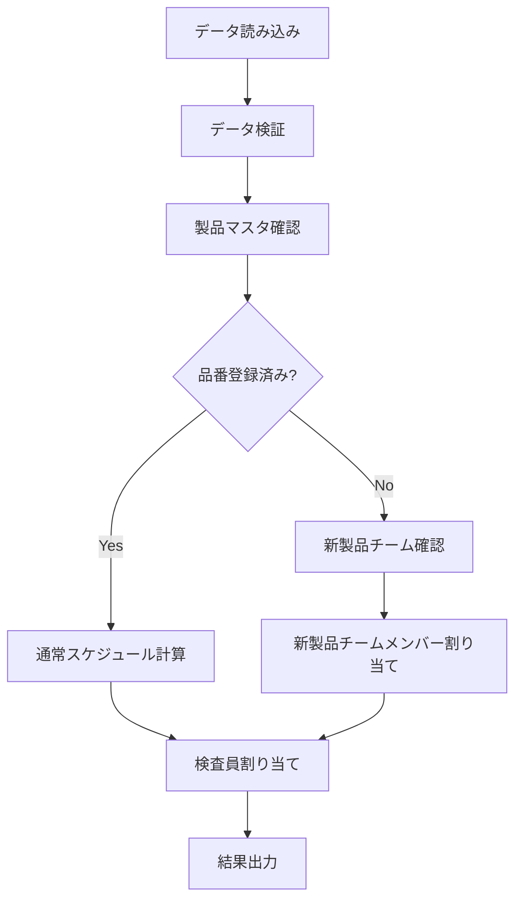

# 検査スケジューラーシステム 製品要件定義書

## 1. Product Overview
検査員の作業スケジュールを自動化し、製品の検査業務を効率的に割り当てるシステムです。
製品の納期、検査時間、検査員の稼働状況を考慮して最適な人員配置を行い、緊急対応が必要な製品を特定します。
製造業における品質管理業務の効率化と納期遵守率の向上を目指します。

## 2. Core Features

### 2.1 User Roles
本システムは管理者による運用を想定しており、特別な役割区分は設けません。

### 2.2 Feature Module
検査スケジューラーシステムは以下の主要機能で構成されます：
1. **データ管理機能**: 製品マスタ、検査員マスタ、出荷不足データの読み込みと検証
2. **スケジュール計算機能**: 検査開始期限の算出と緊急度判定
3. **人員割り当て機能**: 優先順位に基づく検査員の自動割り当て
4. **分析・レポート機能**: キャパシティ分析と優先製品リストの生成

### 2.3 Page Details

| Page Name | Module Name | Feature description |
|-----------|-------------|---------------------|
| データ管理 | データ読み込み | CSV/Excelファイルからマスタデータと出荷不足データを読み込み、データ整合性を検証 |
| データ管理 | データ検証 | 必須項目チェック、データ型検証、参照整合性確認を実行 |
| スケジュール計算 | 期限算出 | 納期と検査時間から検査開始期限を自動計算 |
| スケジュール計算 | 緊急度判定 | 期限までの日数に基づいて緊急度レベル（1-4）を設定 |
| 人員割り当て | 優先順位付け | 納期、緊急度、作業量に基づいて製品の処理順序を決定 |
| 人員割り当て | 検査員割り当て | 検査員の稼働状況と専門性を考慮した自動割り当て |
| 人員割り当て | 新製品対応 | 製品マスタ未登録品番に対する新製品チームメンバーの優先割り当て |
| 分析・レポート | キャパシティ分析 | 検査員の作業負荷と稼働率を分析 |
| 分析・レポート | 優先リスト生成 | 緊急対応が必要な製品の一覧を生成 |

## 3. Core Process

### メインワークフロー
1. システム起動時にマスタデータ（製品マスタ、検査員マスタ）と出荷不足データを読み込み
2. データ整合性を検証し、エラーがある場合は警告を表示
3. 各製品の検査開始期限を計算し、緊急度レベルを判定
4. 優先順位に基づいて製品をソートし、検査員を割り当て
5. 割り当て結果とキャパシティ分析結果を出力

### 新製品対応フロー
1. 製品マスタに品番が存在しない場合を検出
2. 検査員マスタの「新製品チーム」列（H列）に★マークがあるメンバーを特定
3. 新製品チームメンバーを優先的に割り当て
4. 新製品チームで対応できない場合は通常の割り当てロジックを適用

## 4. User Interface Design

### 4.1 Design Style
本システムはコマンドライン/バッチ処理システムのため、GUIは提供しません。
- 出力形式: CSV、Excel、コンソール出力
- ログレベル: INFO、WARNING、ERROR
- 文字エンコーディング: UTF-8
- 日付形式: YYYY-MM-DD

### 4.2 Page Design Overview

| Page Name | Module Name | UI Elements |
|-----------|-------------|-------------|
| コンソール出力 | ログ表示 | 処理状況、エラー情報、警告メッセージをタイムスタンプ付きで表示 |
| ファイル出力 | 結果出力 | 割り当て結果をCSV形式で出力、列ヘッダーは日本語表記 |
| ファイル出力 | 分析レポート | キャパシティ分析結果をExcel形式で出力、グラフ表示対応 |

### 4.3 Responsiveness
本システムはサーバーサイド処理のため、レスポンシブ対応は不要です。
