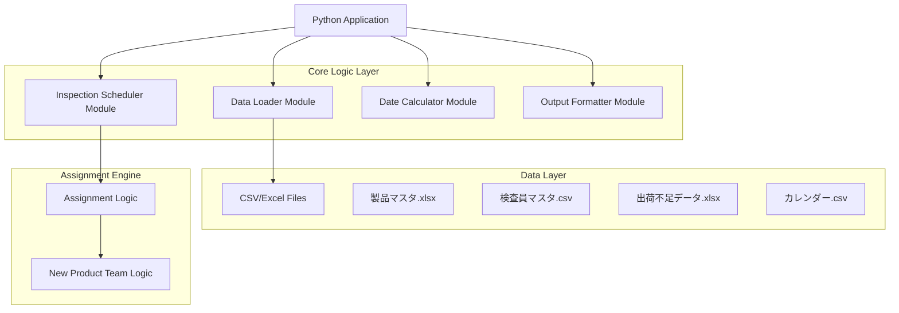
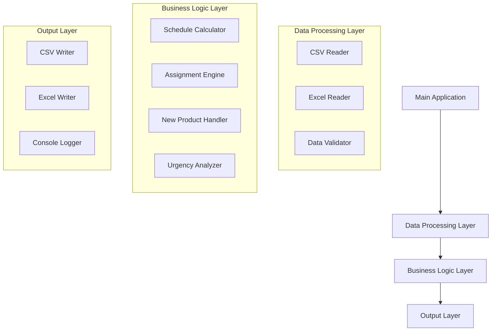
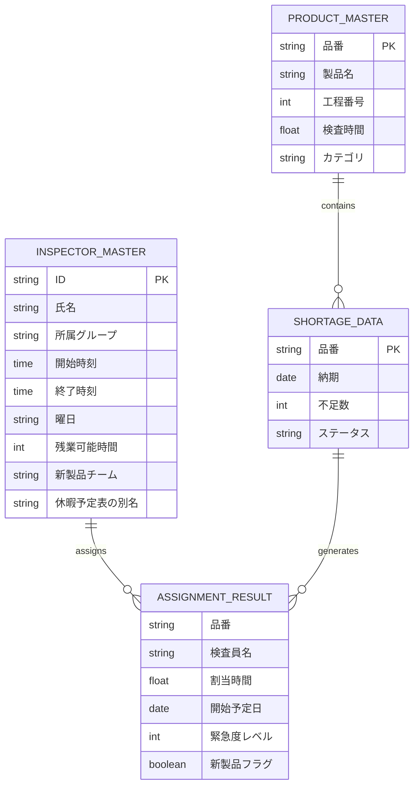

# 検査スケジューラーシステム 技術アーキテクチャ文書

## 1. Architecture design



## 2. Technology Description

* Frontend: None (コマンドライン/バッチ処理システム)

* Backend: Python 3.8+ + pandas + openpyxl

* Data Processing: pandas for CSV/Excel manipulation

* Logging: Python標準ライブラリ logging

## 3. Route definitions

本システムはWebアプリケーションではないため、ルート定義はありません。
メインエントリーポイント: `main.py`

## 4. API definitions

### 4.1 Core API

内部モジュール間のインターフェース定義

#### DataLoader クラス

```python
class DataLoader:
    def load_all_data() -> Tuple[pd.DataFrame, pd.DataFrame, pd.DataFrame]
    def validate_data(shortage_data: pd.DataFrame, product_master: pd.DataFrame) -> bool
    def get_process_and_inspection_time(shortage_data: pd.DataFrame, product_master: pd.DataFrame) -> pd.DataFrame
```

#### InspectionScheduler クラス

```python
class InspectionScheduler:
    def calculate_schedules() -> pd.DataFrame
    def assign_inspectors() -> pd.DataFrame
    def assign_new_product_team(product_code: str) -> List[str]  # 新機能
    def get_urgent_products(max_days: int = 3) -> pd.DataFrame
```

#### 新製品チーム割り当て関数

```python
def get_new_product_team_members(inspector_master: pd.DataFrame) -> List[str]:
    """
    検査員マスタから新製品チームメンバーを取得
    Args:
        inspector_master: 検査員マスタデータ
    Returns:
        新製品チームメンバーの氏名リスト
    """
    pass

def assign_to_new_product_team(product_code: str, required_hours: float, team_members: List[str]) -> Dict:
    """
    新製品チームメンバーに作業を割り当て
    Args:
        product_code: 品番
        required_hours: 必要作業時間
        team_members: 新製品チームメンバーリスト
    Returns:
        割り当て結果辞書
    """
    pass
```

## 5. Server architecture diagram



## 6. Data model

### 6.1 Data model definition



### 6.2 Data Definition Language

#### 検査員マスタ (inspector\_master.csv)

```csv
-- CSVファイル構造
#ID,#氏名,所属グループ,開始時刻,終了時刻,曜日,残業可能時間,新製品チーム,休暇予定表の別名
V002,鈴木悦代,B,8:30,17:30,月火水木金,0,★,
V004,新井登志子,B,8:30,17:30,月火水木金,0,★,
```

#### 製品マスタ (product\_master.xlsx)

```excel
-- Excelファイル構造
品番 | 製品名 | 工程番号 | 検査時間 | カテゴリ
ABC001 | 製品A | 100 | 2.5 | 標準品
XYZ999 | 製品X | 200 | 4.0 | 特殊品
```

#### 出荷不足データ (shortage\_data.xlsx)

```excel
-- Excelファイル構造  
品番 | 納期 | 不足数 | ステータス
ABC001 | 2024-01-15 | 100 | 緊急
NEW001 | 2024-01-20 | 50 | 新製品
```

#### 新製品チーム判定ロジック

```python
# 新製品チームメンバー抽出条件
# 検査員マスタの「新製品チーム」列（H列、インデックス7）に「★」が入っているメンバー
new_product_members = inspector_master[inspector_master['新製品チーム'] == '★']['氏名'].tolist()

# 製品マスタ未登録品番の判定
unregistered_products = shortage_data[~shortage_data['品番'].isin(product_master['品番'])]

# 新製品チーム優先割り当てロジック
for product in unregistered_products:
    if new_product_members:
        assign_to_team(product, new_product_members)
    else:
        assign_to_regular_team(product)
```

